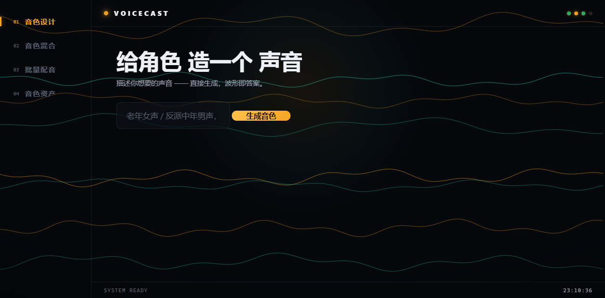

# 🎙️ VoiceCast 声演工作室

**以角色为中心的 AI 配音工作台** —— 描述/混合/微调"造出"角色专属声音，角色表锁死跨集一致，剧本一键批量出**可直进剪映的成品包**（分句音频 + 对齐 SRT 字幕）。

<p align="center">
  
</p>

**本地优先、零供应商依赖**——无任何 API key 也能全流程运行；GPT-SoVITS / F5-TTS / edge-tts / MiniMax 都是可插拔引擎。

> ⚠️ 项目仍处开发期（Beta）。界面（Web 前端）与引擎层持续迭代中。

---

## ✨ 特性

| 特性 | 说明 |
|---|---|
| 🎨 **音色设计器** | 输入"老年女声"→ 规则/LLM 翻译 → **直接生成**一个最匹配的音色 → 波形可视化试听 |
| 🎭 **音色混合器** | 主参考 × 辅助参考 → **GPT-SoVITS 多说话人融合**出独特新声线（55 真人参考两两组合 = 数千种潜在音色） |
| 🎚️ **去 AI 味后处理** | 呼吸声注入 + 微颤动 + EQ 塑形 + 压缩限幅 + 混响 + LUFS（off/clean/natural 三档，配方级控制） |
| 🎭 **角色表 Cast** | 角色 ↔ 配方 ↔ 情绪 持久化（YAML），跨集听感不漂移 |
| 📜 **剧本流水线** | 标记式剧本 → 分角色批量生成 → 规范命名 + manifest 账本 |
| 🔧 **单句修复** | 批量后某句错了/改台词 → **只重跑那一句**（Web 逐句试听/重生成） |
| 📦 **剪映交付包** | 一键导出：**对齐 SRT 字幕**（按集时间轴自动累计）+ 导入说明（音频命名即轨位） |
| 💰 **成本路由 + 降级链** | 本地(0元)→GPT-SoVITS(0元)→edge-tts(0元)→MiniMax(按量)；宿主不可用自动降级（GPT 服务离线 → F5-TTS 兜底） |
| 🖥️ **Web 前端（声波幻境）** | FastAPI + 自研前端：全屏活波形粒子场、开屏仪式、拆字标题、Spotlight——工具界面本身就是"声音" |
| 🔒 **合规门禁** | 音色溯源 + 克隆门禁（仅自有授权声音）+ 敏感词过滤 |
| 🌐 **真人参考库** | **AISHELL-3（Apache-2.0）**：55 说话人/165 段（性别×年龄×口音），40 个 3-10s 拼接参考，55 条可路由配方 |

## 🚀 快速开始

```bash
# 1. 安装（Python 3.11+，建议 uv）
uv venv .venv --python 3.11
uv pip install --python .venv -e . -i https://pypi.tuna.tsinghua.edu.cn/simple

# 2. 引擎状态（零配置即可用——edge-tts 兜底）
voicecast engines

# 3. Web 界面（推荐入口）
python -m uvicorn voicecast.web.server:app --host 127.0.0.1 --port 7860
#   Windows 双击 web.bat
#   打开 http://127.0.0.1:7860

# 4. 命令行
voicecast design "老年女声"                                  # 描述 → 直接生成
voicecast blend aishell3_SSB0016 aishell3_SSB0309 --save    # 主×辅 → 融合新音色
voicecast run examples/script_demo.txt examples/cast_demo.yaml --out-dir outputs/demo
voicecast export outputs/demo                                # → 剪映交付包（SRT）
```

### 生产级克隆（GPT-SoVITS，可选但推荐）

```bash
gptsovits_api.bat    # 一键启动（http://127.0.0.1:9880，首次加载模型 1-2 分钟）
```

- 整合包：`lj1995/GPT-SoVITS-windows-package` 的 **v2pro-nvidia50** 版（RTX 50 系专用，8.23GB，hf-mirror 下载）
- 真人配方在线自动走 GPT-SoVITS；**服务离线自动降级 F5-TTS，不报错**

### 本地引擎（F5-TTS，完全离线）

```bash
bash scripts/setup_local_engine.sh   # torch(cu128) + F5-TTS + 模型下载（hf-mirror）
voicecast route male_elderly
```

### 真人参考库重建（数据脚本）

```bash
python scripts/prepare_aishell3.py      # 下载 AISHELL-3(18GB) 后处理：分桶精选/转 24k/文本
python scripts/build_gptsovits_refs.py  # 生成 3-10s 拼接参考（GPT-SoVITS 兼容）
```

## 🧩 架构

```
voicecast/
├── core/        数据模型（VoiceProfile/EnginePref.fallback/Cast/Script/Project）
├── design/      设计器（规则+LLM）+ 混合器（blender）+ 滑杆
├── engines/     适配层：local(F5-TTS)/gpt_sovits/edge_tts/minimax（单例注册表+可用性缓存）
├── postprocess/ 去 AI 味后处理链（ffmpeg，off/clean/natural）
├── pipeline/    剧本解析 → 成本路由 → 批量调度 → 单句修复(rerun) → 归档
├── deliver/     剪映交付包（SRT 时间轴对齐 + 导入说明）
├── compliance/  溯源 + 克隆门禁 + 敏感词
├── web/         FastAPI（server.py: 设计/混合/SSE 批量/rerun/export/资产 API）+ 声波幻境前端
└── recipes/     配方库（voice_profiles + ref_voices_aishell3 + ref_voices_blend）
```

**路由一句话**：音色归属决定"能不能选"（克隆音色焊死宿主引擎），宿主不可用走 fallback 降级链，成本路由决定"选哪个"，质量门槛和预算决定"敢不敢选便宜的"。

## 🔌 引擎支持

| 引擎 | 成本 | 依赖 | 说明 |
|---|---|---|---|
| **GPT-SoVITS（本地）** | 0 元 | 整合包 + `gptsovits_api.bat` | 生产级中文克隆（多说话人融合/情感/语速），RTX 50 专用版 |
| **F5-TTS（本地）** | 0 元 | 显卡 + 模型下载 | 完全离线零样本克隆，GPT 离线时的自动降级目标 |
| **edge-tts** | 0 元 | 联网 | 零 key 免费兜底，8 个中文音色 + 变调配方 |
| **MiniMax** | 按量 | `MINIMAX_API_KEY` | 可选插件，无 key 自动跳过 |

> 音频产物统一 24kHz/16bit 单声道 wav；生成后自动走后处理链。

## 📄 数据格式

```yaml
# cast.yaml —— 一部剧 = 一份文件
cast:
  lin_feng:
    name: 林锋
    voice: aishell3_SSB0016     # 配方 id（真人参考 → GPT-SoVITS 克隆）
    default_emotion: 坚定
```

```txt
# script.txt —— 标记式剧本
【场景】S01
【情绪】平静
【林锋】这把剑，是我师父传下来的。
```

```txt
# 输出命名：E01_S01_lin_feng_001.wav（集_场_角色_句号 → 剪映按角色分轨）
# manifest.json：每句的引擎/配方/成本/溯源全账本
```

## ⚖️ 合规与伦理

- **音色溯源**：每配方记录来源与授权（AISHELL-3 = Apache-2.0，见 `recipes/samples/ref/LICENSE-DATA.md`）
- **克隆门禁**：仅允许克隆自有授权声音，禁止克隆名人/他人声音
- **内容审核**：生成前敏感词过滤，词库可插拔
- 本项目不用于、也不允许用于任何侵权、诈骗、伪造场景

## 📜 许可

- **代码**：MIT License
- **recipes/ 配方库**：CC BY-NC 4.0（数据资产，保留非商用保护）
- **AISHELL-3 参考音频**：Apache License 2.0（数据集自带许可）
- **模型权重**（GPT-SoVITS/F5-TTS）为各自上游许可，不随本仓库分发（见下载脚本）

## 🗺️ 路线图

- ✅ 一期：设计器/混合器/后处理链/角色表/剧本流水线/单句修复/剪映交付包/成本路由+降级链/合规/CLI/Web
- 🔜 二期：GPT-SoVITS batch 服务端提速（探明 4x）、情感→语气指令、自录音色一键入库、音色资产管理 UI 深化
