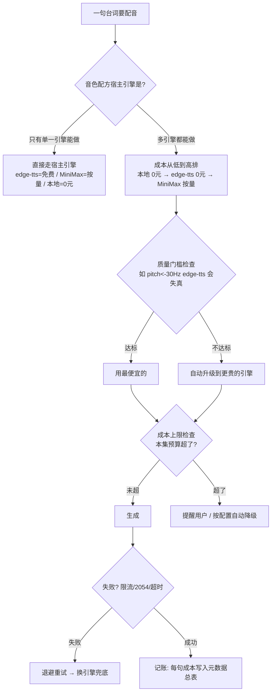

# 《声演工作室》VoiceCast Studio — 项目设计文档

- 日期：2026-08-31
- 状态：**草案待审**（待用户确认项目名、显卡型号后定稿）
- 作者：Hermes × 用户（配音专家 × 逻辑学家协作产出）

---

## 1. 定位一句话

> **以角色为中心的 AI 配音工作台**：描述/混合/微调"凭空设计"出想要的角色声音，用角色表锁死跨集一致性，剧本一键批量出可进剪映的分句音频。MiniMax 只是其中的一个可插拔引擎。

## 2. 背景与立足点（为什么不是"第 N 个 TTS"）

现有工具（MiniMax / edge-tts / 剪映 / Fish Audio）本质都是**"单条配音工具"**：输入文本 + 选个音色 → 吐一条音频。实测（《老街的秤》2026-08）暴露三个结构性缺口：

| 缺口 | 现象 | 本项目解法 |
|---|---|---|
| 没有"角色"概念 | 6 角色 × 17 集，谁用哪个克隆 ID、什么参数，全靠人肉记忆 | **角色表 Cast**：角色↔音色↔情绪参数持久化，git 可版本管理 |
| 声音只能"选/克隆"，不能"设计" | 预设音色太合成被否掉；真人感只能剪映提取+克隆；"35 岁温柔带沙哑女声"没有样本就配不出 | **音色设计器**：描述→配方 / 混合插值 / 滑杆微调 |
| 无"导演控制"和工程化 | emotion 参数不存在（2013 报错）；真人感靠 0.85x/-4/1.1 玄学配方；无成本路由、无重试 | **LLM 配方翻译器 + 成本路由 + 批量调度** |

**立足点一句话：不做"第 N 个 TTS"，做"以角色为中心的配音工作台"。MiniMax 是引擎插件，不是产品本体。**

## 3. 目标用户与主场景

- 目标用户：AI 漫剧/短剧创作者（本项目用户即典型代表）
- 主场景：角色音色设计 → 角色表管理 → 剧本批量配音 → 分轨交付剪映
- 主卖点排序：**音色设计器（惊艳/独特）→ 角色表（架构）→ 剧本流水线（效率）**

## 4. 核心概念与数据模型（GitHub"预留格式" = 这三张表）

### 4.1 VoiceProfile 音色配方（声音的最小单位）

```json
{
  "id": "zhaodeshun_v1",
  "name": "赵德顺-反派商人",
  "design": { "method": "clone" },          // recipe配方 | mix混合 | clone克隆 | preset预设
  "params": { "base_voice": "...", "pitch": -4, "speed": 0.85, "volume": 1.1 },
  "engine": { "host": "minimax", "prefer_local": false },
  "provenance": { "origin": "clone", "authorized": true, "ref_file": "refs/zhaodeshun.wav" },
  "tags": ["反派", "中年", "低沉"]
}
```

### 4.2 Role 角色

```json
{ "id": "zhaodeshun", "name": "赵德顺", "voice": "zhaodeshun_v1", "default_emotion": "沉稳" }
```

### 4.3 Cast 角色表（一部剧 = 一份文件，git 可版本管理）

```yaml
cast:
  chen_shouyi:  { role: 陈守义, voice: chen_shouyi_v1, default_emotion: 沉稳 }
  laozhou:      { role: 老周,   voice: laozhou_v1,     default_emotion: 慈祥 }
  waisheng:     { role: 外甥,   voice: waisheng_v1,    default_emotion: 迷茫 }
  zhaodeshun:   { role: 赵德顺, voice: zhaodeshun_v1,  default_emotion: 阴险 }
  wangshen:     { role: 王婶,   voice: wangshen_v1,    default_emotion: 慈祥 }
  liusao:       { role: 刘嫂,   voice: liusao_v1,      default_emotion: 爽利 }
```

### 4.4 剧本格式（多格式兼容）

- **主格式（txt 标记式）**，贴近编剧习惯，可读可 diff：

```
【情绪】平静
【陈守义】这秤，是祖上传下来的。
【老周】修了一辈子鞋，也没修明白人心。
```

- **内部标准（JSON/JSONL）**：每句一个对象（role/line/emotion/scene/priority）
- **转换器**：txt ↔ JSON 双向互转，SRT/Excel 导入二期补

### 4.5 输出交付

- 分句 wav + 规范命名：`E01_S02_zhaodeshun_003.wav`（集_场_角色_序号）
- 按集/角色目录归档；元数据总表 CSV/JSON：记录每句的引擎/配方/参数/耗时/成本/溯源
- 可直接拖进剪映；工程可复现（输入剧本+角色表 = git 可复现）

## 5. 系统架构

```
voicecast/
├── core/        数据模型（pydantic：VoiceProfile/Role/Cast/Script/Project）
├── design/      ★音色设计器
│   ├── recipe_translator.py   # 描述→配方（LLM + 配方知识库）
│   ├── mixer.py               # 参考音色混合插值
│   └── sliders.py             # 滑杆微调（年龄/低沉/语速/明亮）
├── engines/     ★引擎适配层（可插拔，统一接口）
│   ├── base.py                # Engine 抽象：synthesize(text, voice_profile, emotion) → Audio
│   ├── minimax_engine.py      # MiniMax t2a_v2（含 voice_clone）
│   ├── edge_tts_engine.py     # edge-tts 免费打底
│   ├── cosyvoice_engine.py    # 本地 CosyVoice2（二期）
│   └── gpt_sovits_engine.py   # 本地 GPT-SoVITS（二期）
├── pipeline/    剧本流水线
│   ├── parser.py              # txt/JSON 剧本解析
│   ├── router.py              # ★成本路由（见 §6）
│   ├── scheduler.py           # 批量任务 + 重试 + 记账
│   └── archiver.py            # 输出命名 + 元数据总表
├── compliance/  合规门禁（溯源 + 克隆门禁 + 内容审核）
├── cli/         CLI 入口（typer）
├── web/         Gradio Web（设计器试听对比 + 角色表管理）
└── recipes/     音色配方库（数据资产，CC BY-NC）
```

**关键架构决策：引擎适配层是灵魂**。统一接口 `Engine.synthesize()`，MiniMax / edge-tts / 本地引擎都是插件——这就是"混合路由"的落地点：不是又一个 API wrapper，而是**引擎无关的配音工作台**。

## 6. 成本路由规则（核心设计）

### 6.1 一句话

> **给每句台词自动挑"最便宜又能保证质量"的引擎来生成。**

不是"所有台词用同一个引擎"，而是**逐句自动选**。为什么能逐句选？因为不同的角色音色，本来就住在不同的引擎里。

### 6.2 决策流程



### 6.3 两条规则（按顺序执行）

**规则一（硬约束）：音色归谁，就走谁。**
配方里的 `engine.host` 决定宿主引擎。克隆音色（剪映提取→MiniMax 克隆）只能 MiniMax 生成；edge-tts 配方只能 edge-tts 生成。这一步把大部分台词的路由"焊死"，不纠结。

**规则二（动态选择）：多引擎都能做时，从便宜到贵排，过两道检查。**
- **质量门槛**：例如 pitch 需降到 -30Hz 以下时 edge-tts 失真机械（实测结论）→ 自动升级 MiniMax，不让它硬降
- **成本上限**：用户设"每集配音预算 5 元"，超了提醒或按配置自动降级

### 6.4 实测示例（《老街的秤》六角色）

| 角色 | 音色方案 | 路由结果 |
|---|---|---|
| 老周 70 硬朗大爷 | 剪映提取→克隆 | MiniMax 按量（克隆 ID 焊死） |
| 赵德顺 55 反派 | 剪映低沉→克隆，0.85x/-4 | MiniMax 按量（同上） |
| 外甥 26 迷茫青年 | edge-tts 云希 -24Hz | edge-tts 免费 |
| 王婶 55 慈祥 | MiniMax female-chengshu | MiniMax 按量 |
| 刘嫂 50 爽利 | MiniMax female-chengshu +1 | MiniMax 按量 |

### 6.5 为什么叫"路由"而不是"写死"（价值所在）

- 本地部署 CosyVoice 并克隆老周音色后，配方加一行 `"prefer_local": true` → **改一行配置，老周成本从按量变 0 元**，全剧重跑自动走本地
- 本地效果不满意 → 配置改回 → 自动回 MiniMax
- 失败兜底同属路由职责：MiniMax 报 2054/限流 → 退避重试或降级换引擎

> **一句话总结：音色归属决定"能不能选"，成本路由决定"选哪个"，质量门槛和预算决定"敢不敢选便宜的"。本地引擎装得越多，自动省得越多——"省钱自动挡"。**

## 7. 音色设计器（主卖点）

三合一完整形态，分二期交付：

| 能力 | 说明 | 期数 |
|---|---|---|
| **描述→配方** | LLM 当"配音导演"：把"35 岁温柔带沙哑女声"翻译成 {底声, pitch, speed, vol} 配方 + 解释 | 一期 |
| **滑杆微调** | 基于底声调 年龄/低沉/语速/明亮（实测降调配方产品化） | 一期 |
| **混合插值** | 2-3 个参考音色按比例混合出新音色 | 二期 |

技术判断：**"文字描述→直接生成音色"中文生态不成熟**（ElevenLabs Voice Design 仅英文好用），所以走"LLM 翻译成配方"的务实路径——配方知识库冷启动数据 = 《老街的秤》实测沉淀（见 recipes/）。

## 8. 合规门禁（信任卖点 + GitHub 审核硬要求）

| 门禁 | 内容 |
|---|---|
| **音色溯源** | 每个配方记录来源（原创/参考/克隆）+ 授权状态，输出元数据总表同步携带，"这声音哪来的"可追溯 |
| **克隆门禁** | 克隆仅允许上传自有授权声音，界面声明 + 示例台词自查，禁止克隆名人/他人声音 |
| **内容审核** | 生成前敏感词/违规过滤，可插拔（内置轻量词库 + 可选接审核 API） |

## 9. 交付形态

**三件套**：Python 库（给开发者）+ CLI（接自动化流水线）+ Gradio Web（音色试听对比、角色表管理）。用户偏好全流程自动化，CLI 为主力，Web 为试听/管理。

## 10. MVP 范围（一期）与二期

**一期（MVP）**：
- core 数据模型 + engines（minimax + edge-tts）+ design（描述翻译器 + 滑杆）+ pipeline（txt/JSON 解析 + 成本路由 + 批量 + 归档）+ compliance（三项门禁）+ CLI + Gradio Web
- 验收：描述生成 6 角色音色候选；一键跑完 17 集 × 6 角色剧本；输出直接拖进剪映；全剧成本可控（小成本验证 ≤ 2.5 元级起步）

**二期**：
- 本地引擎（CosyVoice2 / GPT-SoVITS）——**依赖用户显卡型号确认**
- 混合插值、SRT/Excel 导入、自动混音、剪映草稿对接（按需）

## 11. 技术栈

Python 3.11 + pydantic v2 + typer（CLI）+ gradio（Web）+ uv（包管理）+ pytest + ffmpeg。数据全文件化（JSON/YAML），不引数据库，git 友好。

## 12. 许可

- **代码：MIT**（任何人可用）
- **recipes/ 音色配方库：CC BY-NC**（数据资产，保留非商用保护）

## 13. 开放问题（待用户拍板）

1. **项目名/仓库名**：候选 `voicecast`（声演工作室）/ `dubforge` / `voice-studio`；位置建议 `D:\VoiceCast`
2. **显卡型号与显存**（一期不阻塞，二期本地引擎部署用）
3. 配方库冷启动：以《老街的秤》六角色实测配方为第一批数据

## 14. 成功标准

1. 描述"反派中年男声，低沉阴险"→ 出 ≥3 个可试听候选，不比剪映提取差
2. 17 集 × 6 角色剧本一键跑完，跨集同角色听感一致
3. 输出 wav 直接拖进剪映可对齐
4. 每集成本账目清晰（元数据总表），不超预算
5. GitHub 仓库结构完整（README/LICENSE/CI/示例），别人 clone 就能跑
